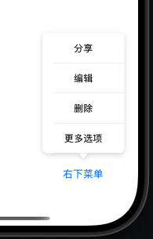
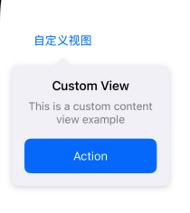

# AMPopover

一个简单且可自定义的 iOS 弹出框组件，支持自动位置调整和箭头指向。

[English](./README.md) | [简体中文](./README_CN.md)

## 特性

- 自动位置调整，确保弹出框始终在屏幕范围内
- 智能箭头指向，自动选择最佳方向
- 可自定义背景颜色、圆角、箭头大小等
- 点击背景自动关闭
- 流畅的动画效果
- 支持 Swift Package Manager 和 CocoaPods

## 智能位置调整

AMPopover 会根据锚点视图智能计算最佳显示位置：

1. 优先在锚点视图下方显示
2. 下方空间不足时自动切换到上方
3. 自动调整水平位置防止超出屏幕边缘
4. 保持最小边距以获得最佳视觉体验



### 自定义内容支持

AMPopover 支持自定义内容视图，让您可以创建丰富且交互性强的弹出框：



## 安装

### Swift Package Manager

```swift
dependencies: [
    .package(url: "https://github.com/owlivendy/AMPopover.git", from: "1.0.0")
]
```

### CocoaPods

```ruby
pod 'AMPopover'
```

## 使用方法

### 基础用法

```swift
// 创建内容视图
let contentView = UIView()
contentView.frame = CGRect(x: 0, y: 0, width: 200, height: 100)

// 创建弹出框
let popover = AMPopover(contentView: contentView)

// 显示弹出框
popover.show(with: anchorView)
```

### 自定义样式

```swift
let popover = AMPopover(contentView: contentView)

// 自定义外观
popover.arrowHeight = 10
popover.arrowWidth = 16
popover.cornerRadius = 12
popover.minMargin = 15
popover.contentBackgroundColor = .systemGray6

// 显示弹出框
popover.show(with: anchorView)
```

### 菜单示例

```swift
// 创建菜单项
let items = [
    AMPopoverMenuItem.item(with: "分享"),
    AMPopoverMenuItem.item(with: "编辑"),
    AMPopoverMenuItem.item(with: "删除")
]

// 创建菜单视图
let menuView = AMPopoverMenuView(menuItems: items)

// 自定义菜单样式
menuView.menuWidth = 120
menuView.rowHeight = 44
menuView.maxHeight = 44 * 4
menuView.menuBackgroundColor = .systemGray6

// 设置选择回调
menuView.didSelectBlock = { item in
    print("选中: \(item.title)")
}

// 显示菜单
menuView.show(with: button)
```

## 系统要求

- iOS 12.0+
- Swift 5.0+

## 许可证

AMPopover 使用 MIT 许可证。查看 [LICENSE](LICENSE) 文件了解更多信息。 